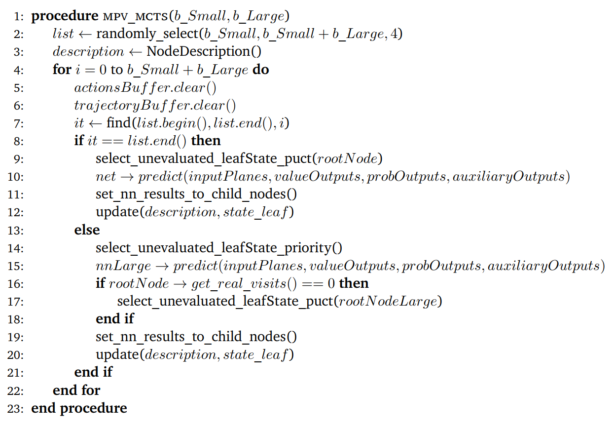
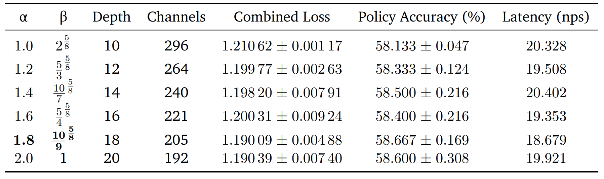
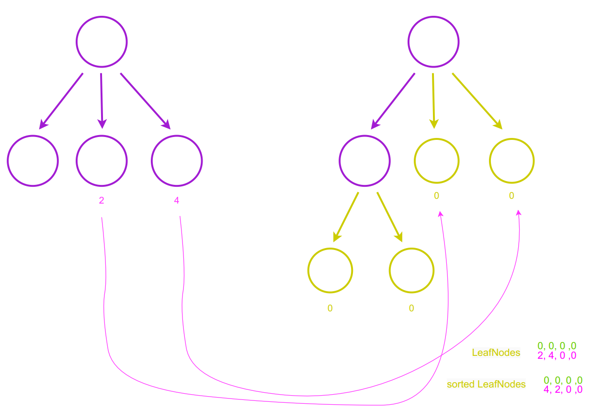

## Contents
*   [Motivation](#motivation)
*   [Pseudocode](#pseudocode)
*   [Hyperparameters](#hyperparameters)
*   [Idea](#idea)
    *   [PUCT](#puct)
    *   [Sorting](#sorting)
*   [How to use](#How to use)

## Motivation
The small network, due to its faster computation, can perform more MCTS simulations, while the large network provides a more accurate state estimation. Then we use MPV MCTS to leverage the strengths of both small and large networks.

## Pseudocode

This is the core pseudocode of our idea. First we randomly select a number list in the range of b_S to b_S + b_L. In the for loop if index is in the chosen list. Then we run PUCT simulation or select priority nodes.

## Hyperparameters

How do we determine depth and channel size? As the table shows, line 5 has the best performance. After multiplying scaling factor we get depth as 32, channels as 218. But because of GPU architectures we have to choose a number which can be divided by 32. So we use 224.

## Idea
### PUCT

On the left is a large tree which has a relatively accurate feature representation. The dotted line connects to the unexpanded node. On the right is a small tree, which is possible to iterate more times. It’s also the main tree. Using the puct formula to update Q_puct. The two trees share the action value. 

### Sorting

We extract the visit count from a small tree and transfer it to a large tree. Subsequently, we arrange the large tree in descending order based on the visit count. Then we can get the same order.

## How to use
